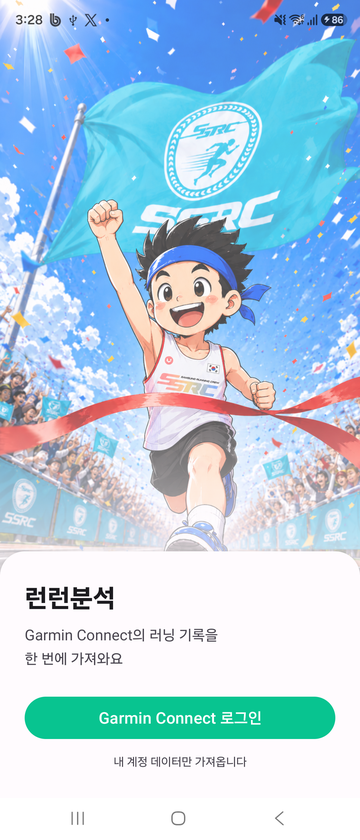
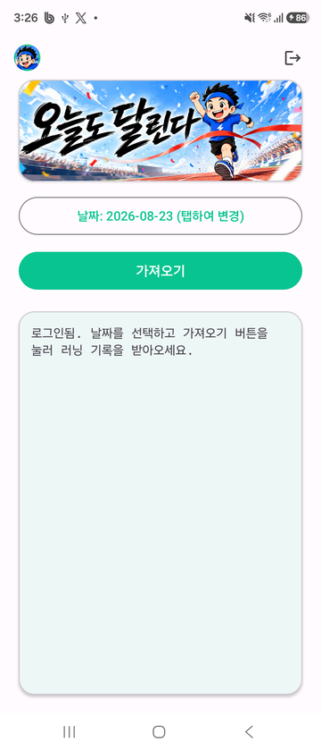

# 런런분석 (RunningPull)

[](https://developer.garmin.com/fit/get-the-sdk/)
[](#빌드)

Garmin Connect에서 매번 손으로 fit 파일을 내려받던 걸 없애려고 만든 개인용 안드로이드 앱.

날짜를 고르면 그날의 러닝을 전부 찾아 fit 파일을 받고, AI 분석용 JSON으로 바꿔서
`Downloads/strongRunner/` 에 저장한다. 러닝이 여러 건이면 각각 따로 저장한다.

VO2max, 젖산 역치(심박·페이스·파워), 최대심박수 같은 fit 파일에 없는 지표까지 붙이고,
10초 간격 원시 기록(`records[]`)과 날씨(기온·습도·이슬점·체감온도·풍속·풍향)도 함께 담아서
JSON 하나만 봐도 그 러닝을 분석할 수 있게 한다.

```
Downloads/strongRunner/웜업러닝_20260820_194125.json
```

<table>
  <tr>
    <td align="center"></td>
    <td align="center"></td>
  </tr>
  <tr>
    <td align="center">시작 화면</td>
    <td align="center">날짜를 고르고 가져오기</td>
  </tr>
</table>

## 어떻게 동작하나

Garmin은 공개 API가 없어서 웹 로그인 흐름을 그대로 쓴다.

- **로그인** — WebView로 실제 Garmin SSO 페이지를 띄워 사용자가 직접 로그인한다.
  앱이 비밀번호를 다루지 않으므로 2단계 인증도 Garmin 쪽이 알아서 처리한다.
  세션 쿠키만 `EncryptedSharedPreferences`에 저장한다.
- **API 호출** — OkHttp 같은 외부 클라이언트로 부르면 Cloudflare가 봇으로 보고 403으로 막는다.
  그래서 로그인 세션을 쥔 **숨은 WebView 안에서 `fetch()`를 실행**하고 결과를
  `JavascriptInterface`로 받아온다. 쿠키·csrf·TLS 지문이 전부 진짜 브라우저 것이라 막히지 않는다.
- **FIT 파싱** — fit은 바이너리 포맷이라 직접 뜯지 않고 **Garmin 공식 FIT SDK**
  ([`com.garmin:fit:21.205.0`](https://central.sonatype.com/artifact/com.garmin/fit),
  [FIT SDK 배포처](https://developer.garmin.com/fit/get-the-sdk/))로 디코딩한다.
  필드 번호·스케일·단위가 SDK의 FIT Profile에 정의돼 있어 값을 추측할 필요가 없다.
  세션/랩 요약뿐 아니라 record(원래 1초 간격)를 10초로 다운샘플링해 `records[]`에 담는다. 심박 드리프트, 오르막 영향, 케이던스 변화, 질주 구간처럼
  요약만으로는 안 보이는 것까지 분석할 수 있게 하면서도 파일이 너무 커지지 않게 하려는 것.
  결승 시점 record는 간격에 안 맞아도 항상 포함한다.
- **부가 지표** — 최대심박수·젖산 역치(심박·파워)는 **fit 파일 안에 그 러닝 당시 설정값이
  들어 있다**(`zones_target` 메시지). 그래서 fit을 1순위로 쓴다. 예전에는 이것들을 Garmin
  API에서 받았는데, 최대심박수 엔드포인트는 날짜 파라미터가 아예 없어서 **5개월 전 러닝에도
  오늘 설정이 붙었다**. 값마다 어디서 왔는지 JSON에 `source`로 남기고, Garmin 값도 대조용으로
  함께 담는다.
- **아직 API가 필요한 것** — VO2max와 젖산 역치 **페이스**는 fit에 대응 필드가 없어 Garmin에서
  받는다. 값이 계속 변하므로 **그 러닝 날짜 시점의 값**을 가져오고 측정일도 함께 남긴다.
- **날씨** — 시계의 온도계는 손목 체온에 영향을 받아 실제 기온으로 못 쓴다. fit의 GPS 좌표와
  시각으로 Open-Meteo 기상 데이터를 조회해 **5km 구간마다**(0km 포함) 기온·습도·이슬점·
  체감온도·풍속·풍향을 붙인다. 소스는 셋 — Open-Meteo의 ERA5 재분석(`archive`) → 같은 곳의
  `forecast` → **NASA POWER**(다른 기관, 키 불필요) 순으로 시도한다. 앞의 둘이 같은 회사라
  그쪽이 통째로 죽을 때를 대비한 것. 실제로 쓴 쪽을 `weather.source`에 남긴다.
- **파생 강도지표** — 이번 러닝의 평균/최고 심박·파워·페이스를 최대심박수·젖산 역치 대비
  %로 미리 계산해 붙인다. AI가 이전 대화 없이 JSON만 보고도 강도를 바로 판단할 수 있게
  하려는 것.

## 설치

빌드 없이 바로 설치하려면 **[Releases](https://github.com/leosonus/RunningPull/releases/latest)**
에서 APK를 받으면 된다.

1. 받은 APK를 안드로이드 기기에서 탭하면 **"이 출처의 앱 설치"** 를 허용하라는 안내가 뜬다 —
   Play 스토어를 거치지 않은 앱이라 정상이다. 허용하고 설치한다
2. 앱을 열어 **Garmin Connect 계정으로 로그인**한다
   (앱이 비밀번호를 직접 다루지 않고 Garmin 공식 로그인 페이지를 띄운다)
3. 받아온 러닝 JSON은 기기의 `Downloads/strongRunner/` 에 저장된다

Android 8.0(API 26) 이상. 소스에서 직접 빌드한 디버그 버전이 이미 깔려 있으면 서명이 달라
설치가 거부되므로, 기존 앱을 먼저 삭제해야 한다(**삭제하면 로그인 세션도 지워져 다시
로그인해야 한다**).

## 빌드

```
./gradlew assembleDebug
```

minSdk 26 / targetSdk 37. 별도 설정이나 API 키는 필요 없다.

**FIT SDK는 zip을 내려받아 `libs/`에 넣을 필요가 없다.** Garmin이 Maven Central에 공식 배포하고
있어서 Gradle이 알아서 받아온다 — `gradle/libs.versions.toml`:

```toml
garminFit = "21.205.0"
garmin-fit = { group = "com.garmin", name = "fit", version.ref = "garminFit" }
```

버전을 올리려면 이 한 줄만 바꾸면 된다. `developer.garmin.com`에서 받는 SDK zip에만 들어 있는
`Profile.xlsx`는 필드 정의 원본이지만, 그 정의가 SDK 생성 소스에 그대로 담겨 있어
(`new Field("total_distance", ..., scale 100, offset 0, "m", ...)`) 빌드에는 필요 없다.

릴리즈 빌드(`assembleRelease`)는 서명 키가 있어야 설치 가능한 APK가 나온다. 키
(`runningpull-release.jks`)와 비밀번호(`keystore.properties`)는 저장소에 올리지 않으므로,
키가 없는 환경에서는 서명 없이 빌드된다(디버그 빌드는 영향 없음).

배포는 GitHub Releases로 한다. 절차는 [RELEASING.md](RELEASING.md) 참고.

## 참고

문서화되지 않은 내부 API를 쓰기 때문에 Garmin이 응답 구조나 로그인 흐름을 바꾸면 깨진다.
본인 계정의 개인 데이터를 가져오는 용도로만 만들었다.

fit 파일 해석에 쓰는 FIT SDK는 Garmin이 배포하는 공식 라이브러리이며
**Flexible and Interoperable Data Transfer (FIT) Protocol License**를 따른다.
